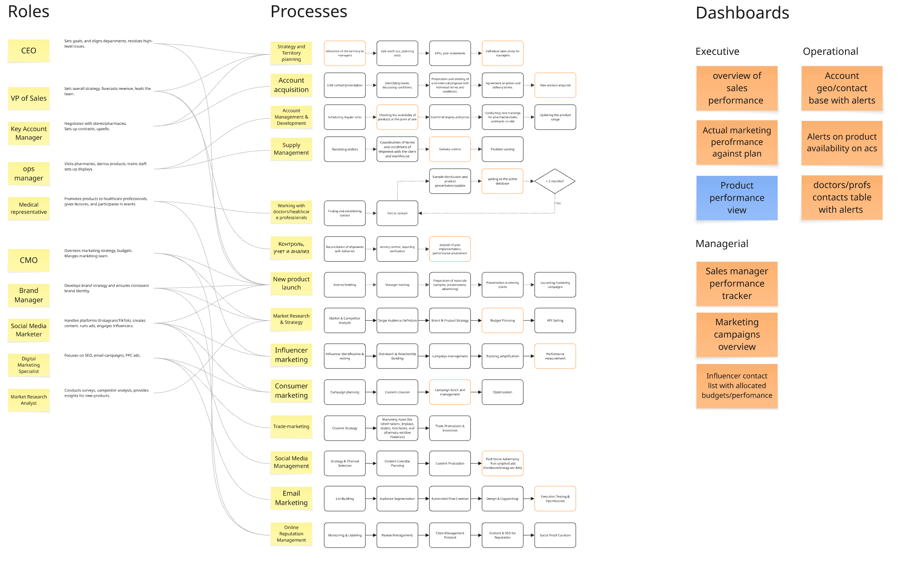
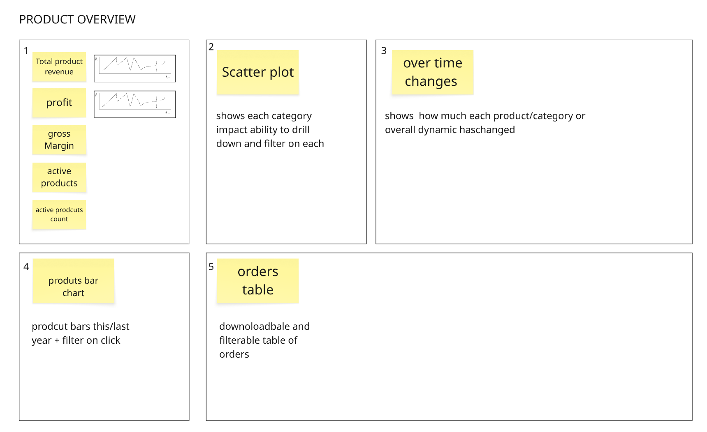
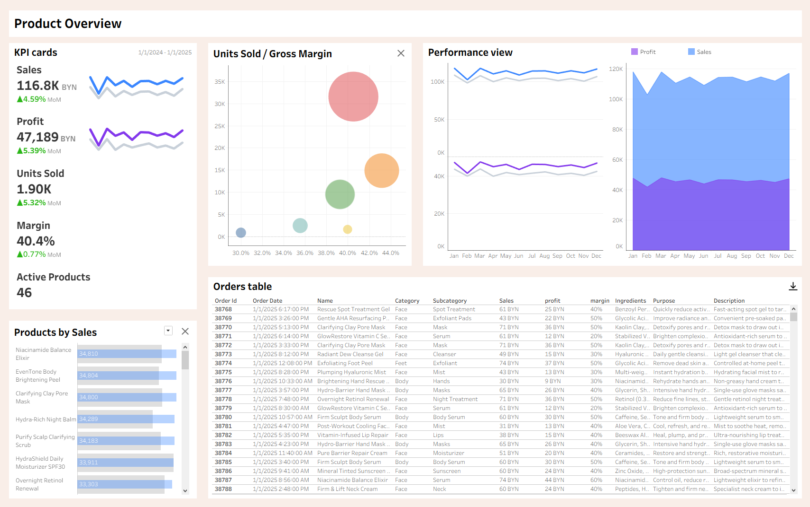
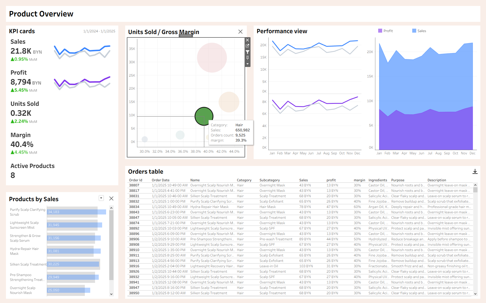
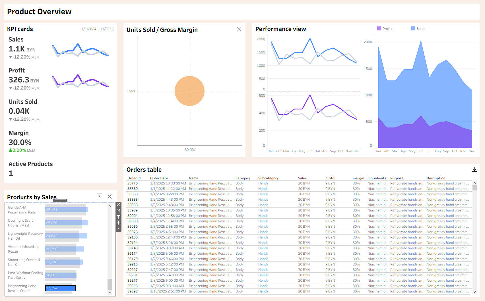

# 📊 Product Performance Dashboard

## 🧩 Business Overview

**Heavenly** — небольшой бренд косметики для ухода за собой.

Компания:

- самостоятельно производит продукцию
- заключает контракты с региональными аптечными сетями
- поставляет товары в офлайн-точки продаж

Одна из основных бизнес-задача — **оценка эффективности продуктовой линейки и принятие продуктовых решений**:

- продолжать ли выпуск продукта
- усиливать ли маркетинговую поддержку
- какие категории продуктов требуют внимания

---

## 🗺️ Dashboard Map & Business Processes

🔗 **Miro Whiteboard (Dashboard Map):**  
https://miro.com/app/board/uXjVGbkd1zA=/?share_link_id=230880523874

Dashboard Map в данном проекте используется как инструмент:

- выявления ключевых ролей (для команд маркетинга и продаж)
- описания бизнес-процессов
- определения необходимой отчетности для принятия решений

На основе процессов команд маркетинга и продаж были сформированы требования к системе продуктовой отчетности.

---

## 🧠 Dashboard Map

---

## 🎯 Dashboard Concept

В качестве итогового решения был выбран **продуктовый дашборд**, основная цель которого —  
**поддержка принятия ключевых продуктовых решений**, таких как:

- прекращение выпуска продукта
- перераспределение рекламного бюджета
- фокус на наиболее эффективных категориях

---

## 🎨 Product Dashboard Mockup

### Структура дашборда:

1. **Key KPIs** — основные продуктовые метрики  
   _(метрики рассчитаны на основе сгенерированных данных)_
2. **Scatter Plot по категориям** — анализ импакта категорий + drill-down
3. **Динамика ключевых метрик во времени**
4. **Bar Chart продуктов** — фильтрация и углубленный анализ по продуктам
5. **Таблица заказов** — фильтрация и экспорт данных

---

## 📊 Tableau Dashboard

🔗 **Interactive Tableau Dashboard:**  
https://public.tableau.com/views/Book1_17665036757640/productdd?:language=en-US&publish=yes

### Реализованный дашборд на основе mockup

---

## 🔎 Interactivity & Filtering

### Filtering by Category (Scatter Plot)

При клике на точку в Scatter Plot:

- выбирается соответствующая категория
- все визуализации и KPI автоматически фильтруются
- формируется срез данных по выбранной категории

---

### Filtering by Product (Bar Chart)

Углубленная фильтрация по конкретному продукту:

- позволяет анализировать метрики отдельного продукта
- применяется ко всем визуализациям и таблице заказов

Каждый отфильтрованный срез данных может быть экспортирован  
для дальнейшей более глубокой аналитики.

---

## 🚀 Outcome & Business Value

Разработанный продуктовый дашборд позволяет бизнесу перейти  
от описательной отчетности к **принятию решений на основе данных**.

С его помощью можно:

- выявлять продукты и категории с отрицательнными метриками
- видеть как категории и продукты меняються во времени
- принимать решение о прекращении или масштабировании продукта
- быстро формировать аналитические срезы для ad-hoc анализа

Дашборд снижает зависимость от ручной отчетности и ускоряет процесс
принятия продуктовых решений за счет единого источника данных.
